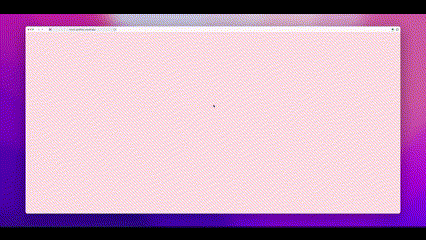

<p align="center">
  Take a look at a brief demo of the portfolio:
</p>

<p align="center">
  
</p>

# Portfolio

A personal portfolio template built with Next.js, designed to showcase your work, skills, and experience. It includes a blog and is optimized for different devices and deployment platforms. The template also comes with a responsive layout, and support for both light and dark mode. The template is easy to customize and comes with a set of pre-built components and utilities to help you quickly build your portfolio website.

## Key Features

-   **Performance Optimized:** Blazing fast performance with a 90%+ reduction in video file sizes, and instant image loading with blur placeholders.
-   **Offline Support:** Full offline capability with a service worker that caches assets and provides a fallback page.
-   **Real-time Performance Monitoring:** Tracks Core Web Vitals, resource loading times, and connection quality.
-   **Modular Data:** Easily update portfolio content by editing individual data files for projects, skills, education, and hackathons.
-   **SEO Friendly:** Optimized for search engines with a high Lighthouse score.
-   **PWA Ready:** Can be installed as a Progressive Web App on mobile devices.

## Tech Stack


-   [Next.js](https://nextjs.org/) 15: React framework for building performant web applications.
-   [React](https://reactjs.org/): JavaScript library for building user interfaces.
-   [TypeScript](https://www.typescriptlang.org/): Superset of JavaScript that adds static typing.
-   [plaiceholder](https://plaiceholder.co/): Generate low-quality image placeholders (LQIPs) for a better loading experience.
-   [sharp](https://sharp.pixelplumbing.com/): High-performance Node.js image processing library.
-   [FFmpeg](https://ffmpeg.org/): A complete, cross-platform solution to record, convert and stream audio and video.
-   [Service Worker](https://developer.mozilla.org/en-US/docs/Web/API/Service_Worker_API): Provides offline capabilities and advanced caching strategies.
-   [shadcn/ui](https://ui.shadcn.com/): Reusable components built using Radix UI and Tailwind CSS.
-   [Tailwind CSS](https://tailwindcss.com/): Utility-first CSS framework for rapid UI development.
-   [Framer Motion](https://www.framer.com/motion/): Production-ready motion library for React.
-   [Magic UI](https://magicui.design/): A set of UI components.

## Features

-   **Easy Setup:** Configuration is done through a single file (`src/data/resume.tsx`).
-   **Blog:** Integrated blog functionality to share your thoughts and ideas.
-   **Responsive Design:** Adapts to different screen sizes and devices.
-   **Optimized for Next.js and Vercel:** Designed for performance and easy deployment.

## Migration to Next.js 15

This project has been migrated to Next.js 15. Key updates include:

-   `next` and `eslint-config-next` dependencies updated to version `^15.2.2` in `package.json`.
-   Type definitions in `src/app/blog/[slug]/page.tsx` explicitly define the `PageProps` type and await the `params` object.

## Scripts

This project includes the following scripts to help manage assets:

-   `npm run compress:videos`: Compresses all videos in the `public/videos` directory using FFmpeg. The compressed videos are saved in the `public/compressed` directory.
-   `npm run generate:blur-data`: Generates blur data URLs for all images in the `public/images` directory. The blur data is saved in a JSON file that can be used by the `OptimizedImage` component.

## Getting Started Locally

1.  Clone the repository:

    ```bash
    git clone https://github.com/han669669/han-portfolio
    ```

2.  Navigate to the project directory:

    ```bash
    cd portfolio
    ```

3.  Install dependencies:

    ```bash
    npm install
    ```

4.  Start the development server:

    ```bash
    npm run dev
    ```

5.  Customize the portfolio by editing the data files in `src/data`, and `src/data/resume.tsx` for personal details

## Credits

This project is inspired by and incorporates elements from [dillionverma/portfolio](https://github.com/dillionverma/portfolio).

## License

Licensed under the [MIT license](https://github.com/dillionverma/portfolio/blob/main/LICENSE.md).
