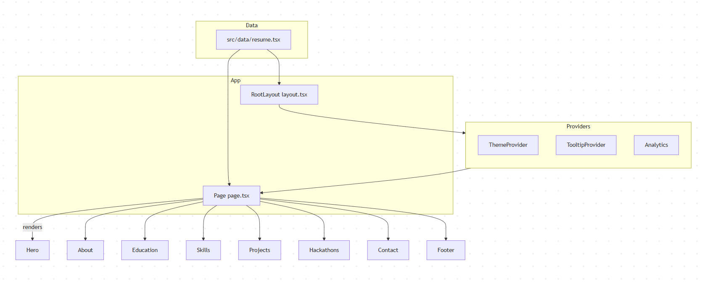

# Han Portfolio Project Review

---

## Overview

A personal portfolio and blog built with **Next.js 15**, **React 18**, and **TypeScript**, designed for easy customization via a centralized data file. It features a responsive, animated UI with light/dark mode, showcasing projects, skills, education, and hackathon participation.

---

## Architecture

- **RootLayout**: Sets metadata, fonts, global styles, and wraps app with providers.
- **Page**: Renders sections dynamically from `DATA`.
- **Components**: `BlurFade`, `BlurFadeText`, `ResumeCard`, `ProjectCard`, `HackathonCard`, `Badge`, `Avatar`.
- **Data**: Centralized in `src/data/resume.tsx`.

---

## Key Components

- **RootLayout**: Global metadata, theme, tooltip, analytics.
- **Page**: Main content, animated sections.
- **BlurFade / BlurFadeText**: Animated reveal effects.
- **ResumeCard / ProjectCard / HackathonCard**: Display education, projects, hackathons.
- **DATA object**: Single source of truth for all content and metadata.

---

## Code Quality Assessment

- **Modern React**: Functional components, hooks, Next.js app directory.
- **Styling**: Tailwind CSS, utility-first, responsive.
- **Animations**: Framer Motion, custom components.
- **Content management**: Centralized, easy to update.
- **Type safety**: Uses TypeScript, but could improve with explicit interfaces for data.
- **Separation of concerns**: Good, with clear layout, data, and components.
- **Testing**: No tests found — potential area for improvement.
- **Accessibility**: Not fully assessed, but should be reviewed.

---

## Design Patterns Used

- **Content-driven rendering**: UI generated from structured data.
- **Component composition**: Reusable, composable UI blocks.
- **Centralized configuration**: Single data file for all content.
- **Provider pattern**: Context providers for theme, tooltips, analytics.

---

## Notable Strengths

- **Highly customizable** via a single data file.
- **Clean, modern architecture** leveraging Next.js 15 features.
- **Attractive, animated UI** with Framer Motion and Tailwind.
- **Good use of open-source UI libraries** (shadcn/ui, Radix UI).
- **Responsive design** with light/dark mode.
- **Content-rich**: supports blog, projects, hackathons, contact info.

---

## Potential Improvements

- **Type safety**: Define TypeScript interfaces for `DATA` to catch errors early.
- **Data modularization**: Split large `DATA` object into smaller files (e.g., `projects.ts`, `education.ts`).
- **Testing**: Add unit and integration tests for components and pages.
- **Accessibility**: Audit and improve ARIA labels, keyboard navigation, color contrast.
- **Performance**:
  - Lazy load images and videos.
  - Optimize bundle size.
  - Use Next.js image component for responsive images.
- **Content management**:
  - Consider MDX or CMS integration for blog/posts.
  - Externalize hackathon/project data if it grows.

---

## Weaknesses

- **Monolithic data file** may become hard to maintain.
- **Lack of tests** reduces confidence in changes.
- **Potential accessibility gaps**.
- **No evident error handling** or fallback UI.